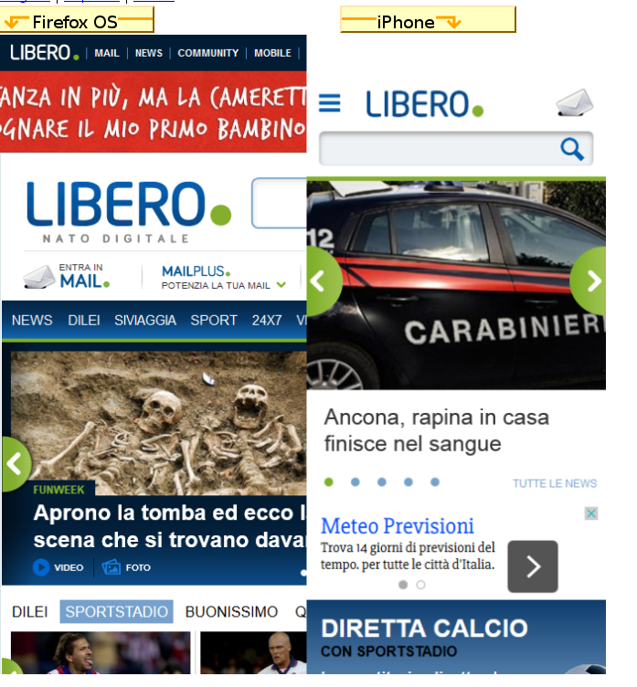
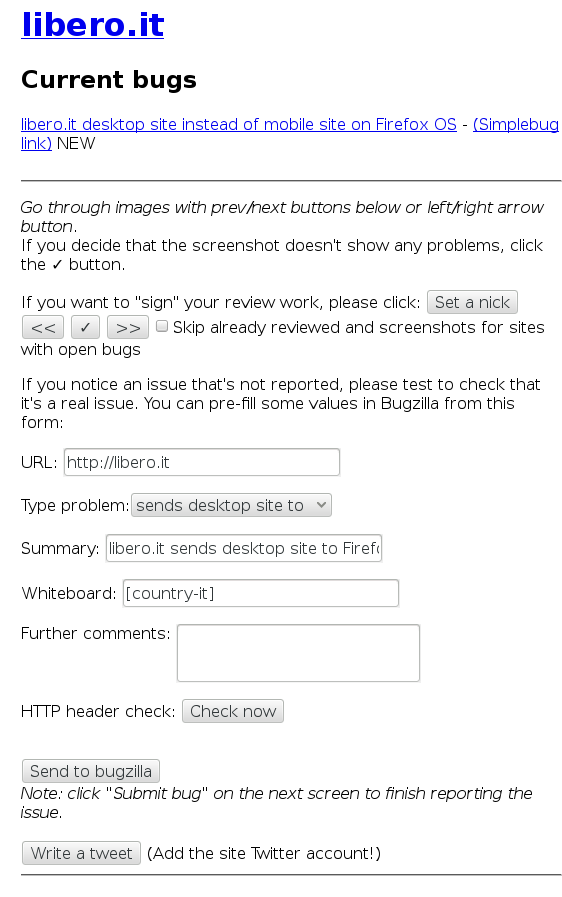

#Italian Web Compatibility
"L'incubo dei servizi di assistenza dei portali italiani"
##chi siamo
Siamo un gruppo di volontari Mozilla Italiani che fanno riferimento all'associazione Mozilla Italia. Al momento i membri di questo team sono: 
- Niccolò "nicokant" Cantù
- Daniele "Mte90" Scasciafratte
- Aronne "aroblu94" Brivio
- Potresti essere tu il prossimo!

##di cosa ci occupiamo?
Ci occupiamo di trovare, segnalare e comunicare ai responsabili (principalmente tramite i social in modo che la segnalazione sia pubblica e tracciabile) i problemi di compatibilità dei siti italiani con i browser mobile realizzati da Mozilla (Firefox for Android e Firefox OS). Per problemi di compatibilità intendiamo comportamenti diversi che i siti hanno in base al dispositivo e al browser che li visita.  
Facciamo un esempio: visitando il sito ilgiornale.it da un telefono Firefox OS otterrai la stessa pagina che visualizzi da desktop; aprendo invece lo stesso sito da un dispositivo Android o iOS sarai reindirizzato alla versione mobile.

Questo è un bug di compatibilità; infatti molti dei servizi web italiani non sanno riconoscere Firefox OS come un dispositivo mobile. Una volta trovato il bug lo segnaliamo su Bugzilla e contattiamo i responsabili del sito per fargli avere la segnalazione.



##come contribuire
E' semplicissimo, in primo luogo [a questo link](http://forum.mozillaitalia.org/index.php?topic=62977.0) trovi la discussione sul forum di Mozilla Italia che usiamo per coordinarci e segnalare i nuovi ticket aperti. Al momento abbiamo una lista che comprende 50 tra i più visitati siti italiani, con un buon numero di bug; alla lista però andranno man mano aggiunti nuovi siti di cui segnalare gli eventuali bug.

##Get Started - tutto quello di cui hai bisogno
- Account Bugzilla 
- Account Twitter 
- Browser Firefox for Android o Firefox OS (Simulator)

Insomma niente di particolare.  
Twitter lo usiamo per contattare i gestori del sito e per fargli avere un link al ticket con l’errore e i dati tecnici.

##segnalare un bug
arewecompatibleyet.com mette a disposizione [un tool integrato](http://arewecompatibleyet.com/screenshots/?cctld=it#0) nel sito che rende facile la segnalazione dei bug. Si tratta di una pagina con screenshots comparativi, a sinistra Firefox OS e a destra iPhone.  
Prima di segnalare un bug controlla che non ci sia già un ticket aperto a riguardo, sulla destra subito sotto il nome trovi l’elenco con i link. Sotto trovi i campi in parte pre-compilati per aprire il ticket. L’unico da compilare riguarda “altri commenti” in cui è consigliato l’inserimento di una spiegazione più dettagliata del problema.  
Questo perchè chi legge il report magari non riesce a capire il problema, fornire una descrizione (anche in italiano) è d’aiuto. Dopodiche clicca su verifica header HTTP; il sito verrà verificato a livello tecnico comparando il suo comportamento simulato con un browser mobile standard. Premi OK e i dati tecnici verranno aggiunti automaticamente alla fine della tua descrizione. Non resta che inviare su bugzilla!  
qui [un esempio di una buona segnalazione](https://bugzilla.mozilla.org/show_bug.cgi?id=1115845#c2).

;
##contattare i tecnici 
Grazie a Daniele ora anche contattare i tecnici è possibile direttamente dalla pagina degli screenshots. Premendo “fai un tweet” verrà generato un tweet a cui dovrete aggiungere il link al bug e il sito web a cui twittarlo.

Dopo che il tweet è stato pubblicato prendete nota del link e nel andando sulla pagina del vostro bug aggiungete un commento dicendo che il sito in questione è stato contattato e allegando il link alla vostro tweet.

E poi non resta che aspettare!

##e quando non ci sono siti ce li aggiungiamo!
Si tratta di un lavoro graduale, si inizia con 25 siti e quando tutti i bug sono stati segnalati si valuta l’aggiunta di nuovi siti alla lista. Noi attualmente utilizziamo [un pad collaborativo](https://etherpad.mozilla.org/o1V5wPuXgV) per stilare questa lista e decidere quali vale la pena aggiungere. 

I siti vengono elencati senza aggiungere il ```www.``` ma solo con il ```nome.dominio```. Dato che dobbiamo effettuare controlli per verificare il supporto mobile focalizzeremo la nostra attenzione sulle principali categorie visitate da mobile: news, meteo, trasporti, operatori telefonici e servizi email. I siti dovranno essere principalmente italiani, perché sono già presenti altri team che si occupano di compatibilità “più globali”.

Una volta che avremo deciso un buon numero di siti, li aggiungeremo alla repository di GitHub che si occupa di renderli disponibili. Entro qualche giorno.

##contatti
Niccolò Cantù - @nicokant - niccolocantu@gmail.com
Daniele Scasciafratte - @Mte90Net 
 
##una piccola sorpresa
Non appena avrai il aperto il tuo primo ticket potrai ricevere l’esclusivo open badge che certifica il tuo impegno nella web compatibility!  
